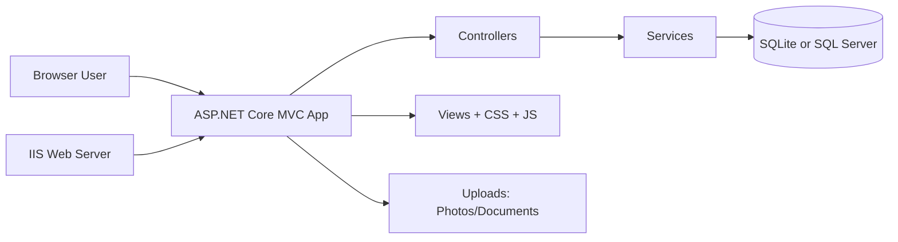

# Contact Management System - Classroom Guide (Beginner Version)

This is a short teaching guide for college students and first-time learners.

## 1. What this software does

This application helps users:

- Store contact details
- Add photos and documents
- Search and filter contacts
- Import and export contact data
- Manage users, groups, and permissions

## 2. 60-second architecture view



## 3. Tools and technologies in simple words

### C#
- Main programming language used to build app logic.

### .NET 8
- Runtime platform that runs the application.

### ASP.NET Core MVC
- Web framework used to organize code into:
  - Model (data)
  - View (UI)
  - Controller (request handling)

### Razor Views
- Page templates where C# and HTML are used together.

### Entity Framework Core
- Database access tool (ORM) that lets developers work with C# classes instead of writing SQL all the time.

### SQLite and SQL Server
- Two database options supported in the same project.
- SQLite is simple and file-based.
- SQL Server is server-based and enterprise-friendly.

### CsvHelper, EPPlus, QuestPDF
- CsvHelper: CSV import/export
- EPPlus: Excel import/export
- QuestPDF: PDF export

### IIS
- Windows web server used to host app on local machine with URL.
- Lets users open URL directly without running dotnet run every time.

### PowerShell scripts
- Used to automate setup, publish, and redeploy tasks.

### Git
- Version control for tracking changes and collaboration.

## 4. Where students should look first in code

1. ContactManagementAPI/Program.cs
2. ContactManagementAPI/Controllers/HomeController.cs
3. ContactManagementAPI/Views/Home/Index.cshtml
4. ContactManagementAPI/Data/ApplicationDbContext.cs
5. ContactManagementAPI/Services/ImportExportService.cs
6. Setup-IIS-Hosting.ps1

## 5. Example: How one page request works

When user opens All Contacts page:

1. Browser requests URL.
2. HomeController receives request.
3. Controller calls database through EF Core.
4. Data is sent to Razor view.
5. HTML table is rendered and shown in browser.

## 6. Beginner lab activity (30 to 45 minutes)

### Lab 1: UI change
1. Open ContactManagementAPI/Views/Home/Index.cshtml
2. Change page heading text
3. Save and refresh URL
4. Observe updated UI

### Lab 2: Style change
1. Open ContactManagementAPI/wwwroot/css/style.v2.css
2. Change button color
3. Refresh browser
4. Observe visual difference

### Lab 3: Data change
1. Add a test contact from UI
2. Search and filter that contact
3. Export to CSV
4. Open exported file and verify data

## 7. Safe change checklist for students

Before editing:
- Read the file purpose first
- Make one small change at a time

After editing:
- Load app in browser
- Test the related feature
- Ensure no error appears

Before finalizing:
- Keep backup with Git commit
- Write what changed and why

## 8. Useful runtime URLs and commands

Primary app URL:
- http://localhost:8080

Quick health check:

```powershell
Invoke-WebRequest http://localhost:8080 -UseBasicParsing
```

IIS start/stop:

```powershell
Start-Website -Name "ContactManagementSystem"
Stop-Website -Name "ContactManagementSystem"
```

Redeploy after code changes:

```powershell
Set-Location E:\Contact_Management_System
.\Setup-IIS-Hosting.ps1 -SiteName "ContactManagementSystem" -AppPoolName "ContactManagementSystemPool" -Port 8080 -ForceRecreateSite
```

## 9. Common beginner mistakes

- Editing many files at once and not testing in between
- Forgetting to refresh browser after CSS change
- Running non-admin command for IIS tasks
- Not checking URL/port and assuming app is down

## 10. Reference documents for deeper learning

- TOOLS_AND_TECHNOLOGIES_USED.md
- USER_GUIDE.md
- DAY_TO_DAY_USE_GUIDE.md
- DEPLOYMENT_GUIDE.md

---

This classroom guide is intentionally short.
Use it first, then move to the full technical guide for deeper understanding.
