# Contact Management System - Screenshot User Manual

## Overview
This manual explains each major screen using the provided screenshots. Follow the steps under each image to understand how to use that screen.

## 1) Login

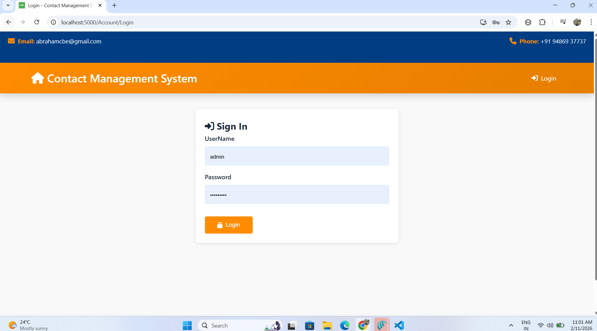

**Purpose:** Secure access to the system.

**Steps:**
1. Enter your username.
2. Enter your password.
3. Click **Login** to continue.

---

## 2) Dashboard

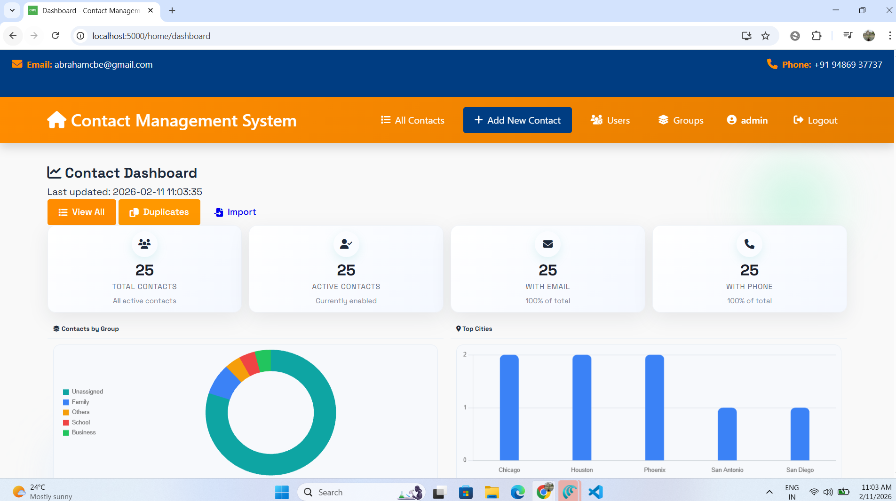

**Purpose:** A quick overview of totals, shortcuts, and recent activity.

**Steps:**
1. Review the summary cards for counts and quick status.
2. Use the shortcut buttons to open key actions (add, import, export).
3. Scroll to review any recent contacts or updates.

---

## 3) All Contacts - Main List

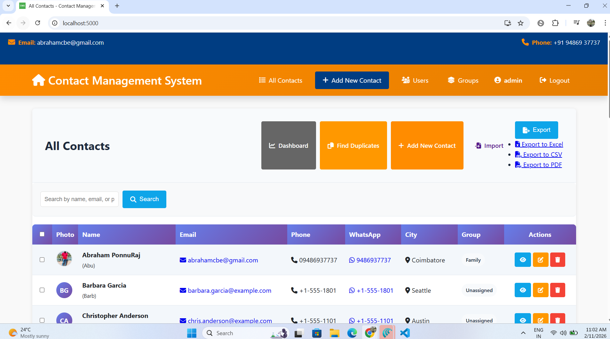

**Purpose:** View all contacts and access common actions.

**Steps:**
1. Use the search box to find a contact by name, phone, or email.
2. Use action buttons to view, edit, or delete a contact.
3. Use pagination to move through pages.

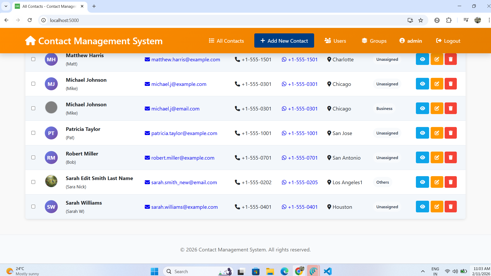

**Steps (continued):**
1. Click **View** to open details.
2. Click **Edit** to update contact information.
3. Click **Delete** to remove a contact (confirmation required).

---

## 4) Add New Contact

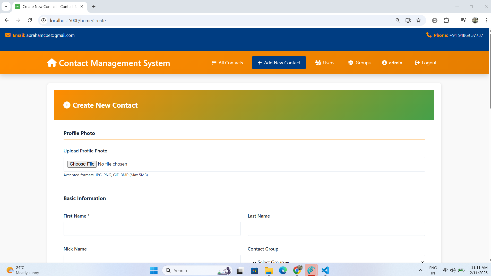

**Purpose:** Create a new contact record.

**Steps:**
1. Enter First Name and/or Last Name (required).
2. Fill in email and phone numbers as needed.
3. Add address and notes for more context.

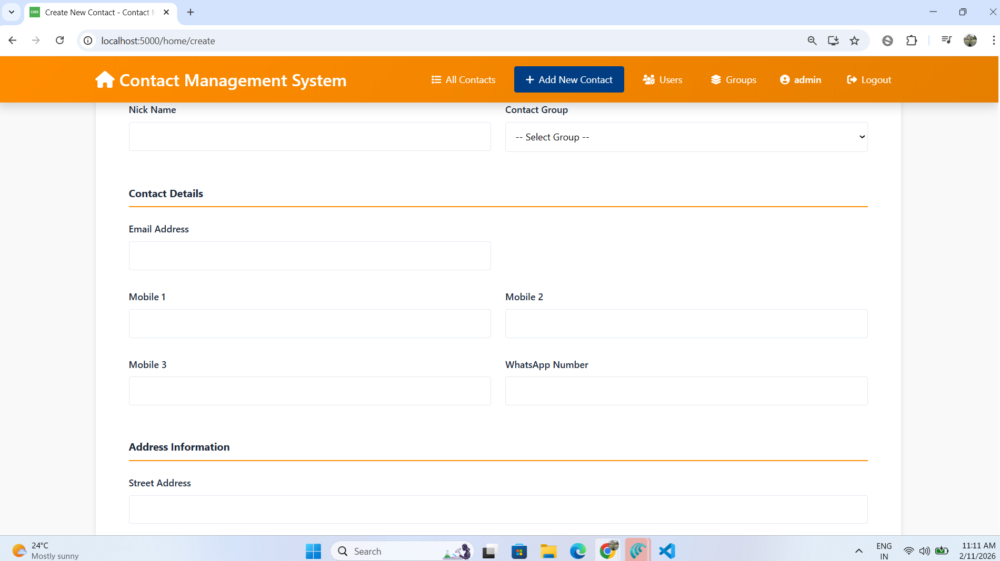

**Steps (continued):**
1. Verify the required fields are completed.
2. Review phone numbers and email formats.

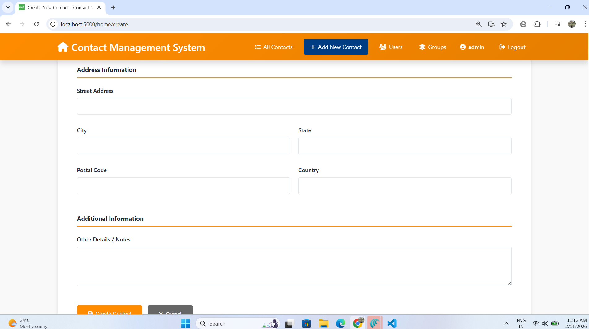

**Steps (continued):**
1. Add optional details such as city, state, and country.
2. Add any notes in the details area.

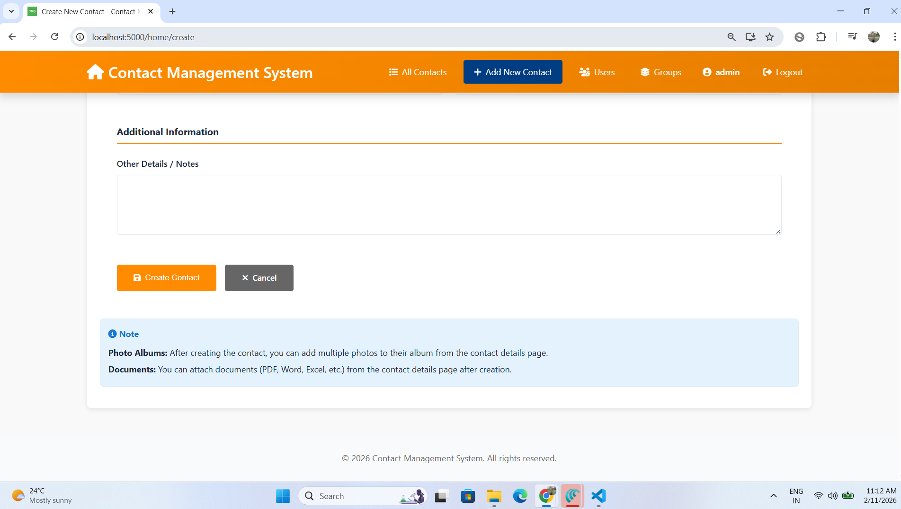

**Steps (final):**
1. Click **Create Contact** to save.
2. Click **Cancel** if you want to discard changes.

---

## 5) Edit Contact Details

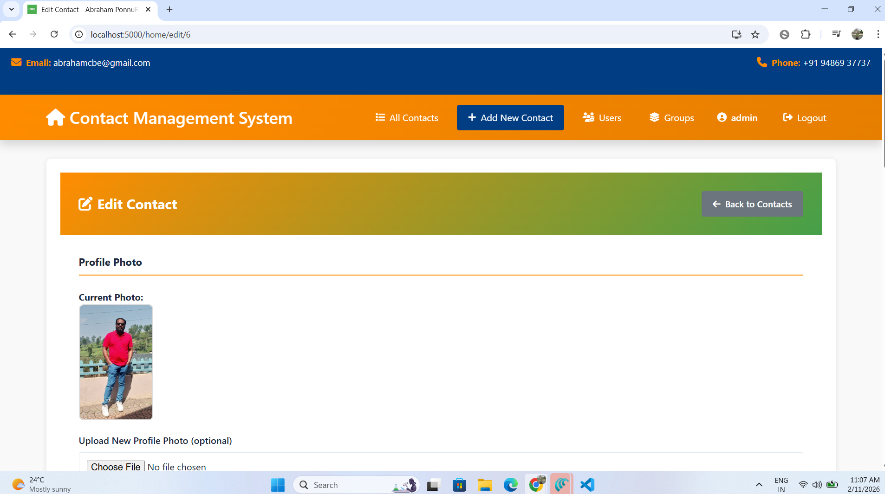

**Purpose:** Update an existing contact.

**Steps:**
1. Modify any fields that changed.
2. Keep required fields filled in.
3. Use the notes area for updates.

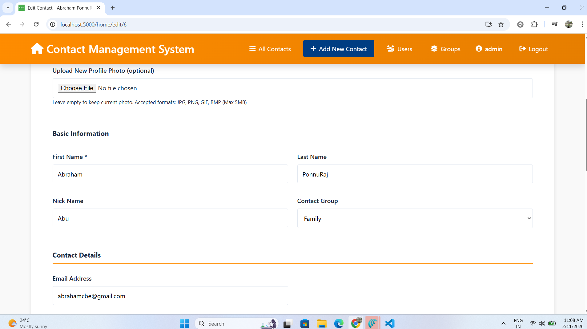

**Steps (continued):**
1. Review contact numbers and email for accuracy.
2. Correct any spelling mistakes.

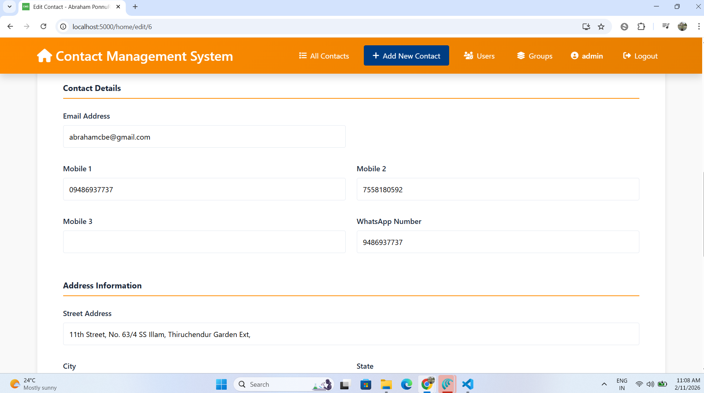

**Steps (continued):**
1. Update address and other optional fields if needed.

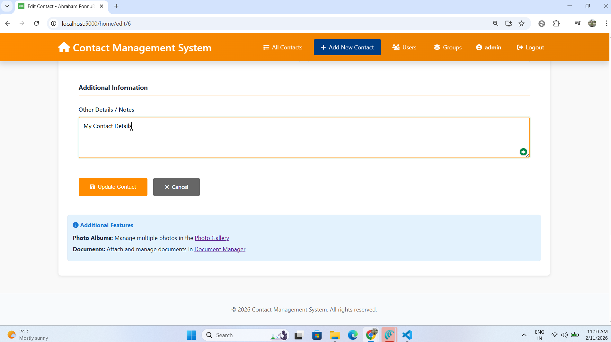

**Steps (final):**
1. Click **Update Contact** to save changes.
2. Click **Cancel** to discard changes.

---

## 6) View Contact Details

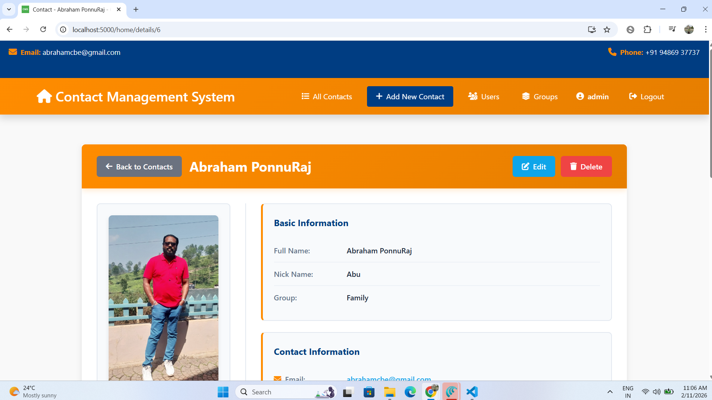

**Purpose:** Review all information for a single contact.

**Steps:**
1. Review contact information at the top.
2. Use action buttons to edit, delete, or manage photos/documents.

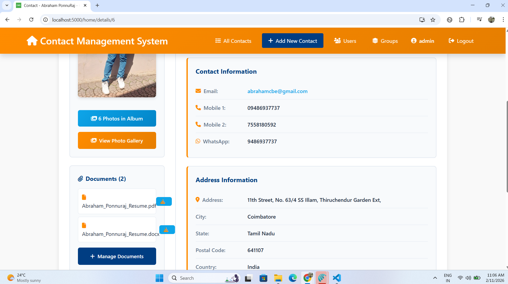

**Steps (continued):**
1. Scroll to see full address and additional details.

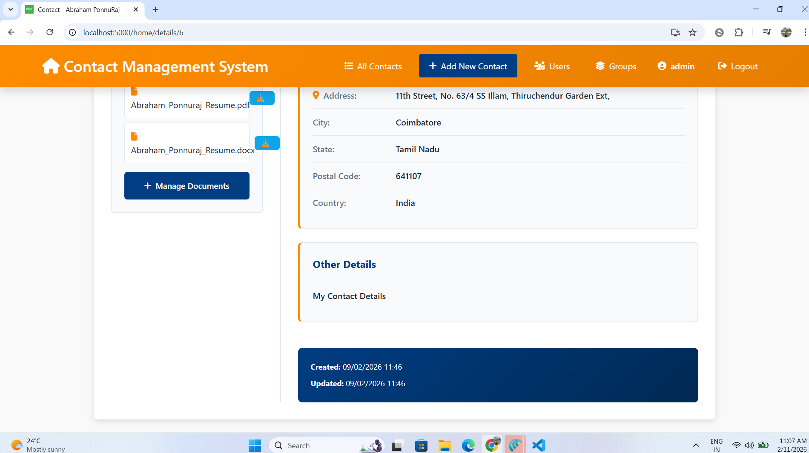

**Steps (final):**
1. Use **Back to Contacts** to return to the list.
2. Use **Edit** if changes are required.

---

## 7) Import Contacts

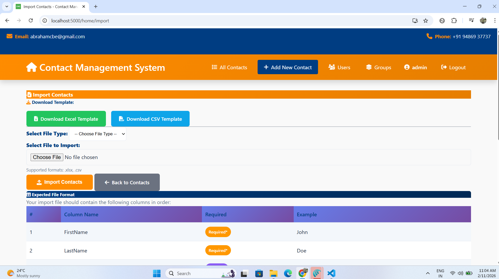

**Purpose:** Import contacts in bulk from Excel or CSV.

**Steps:**
1. Download a template (Excel or CSV).
2. Fill in your contacts using the template columns.

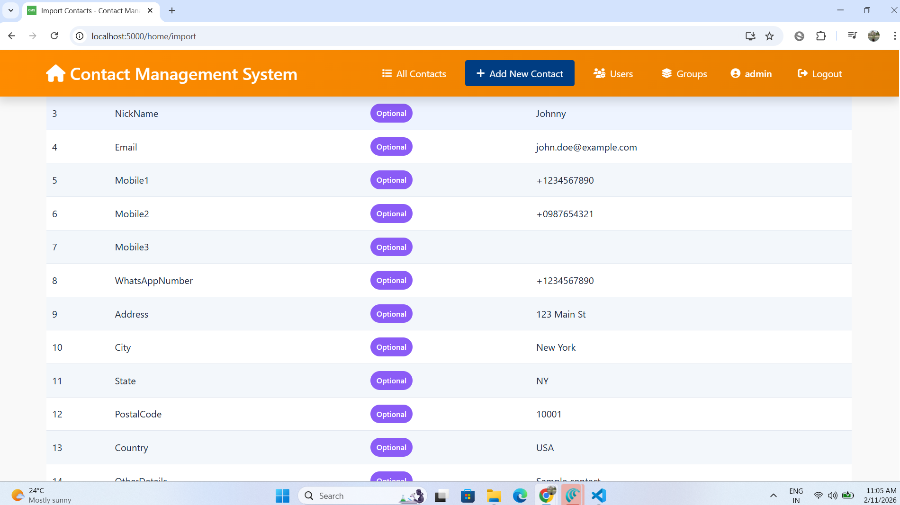

**Steps (continued):**
1. Choose the correct file type from the dropdown.
2. Select the file to upload.

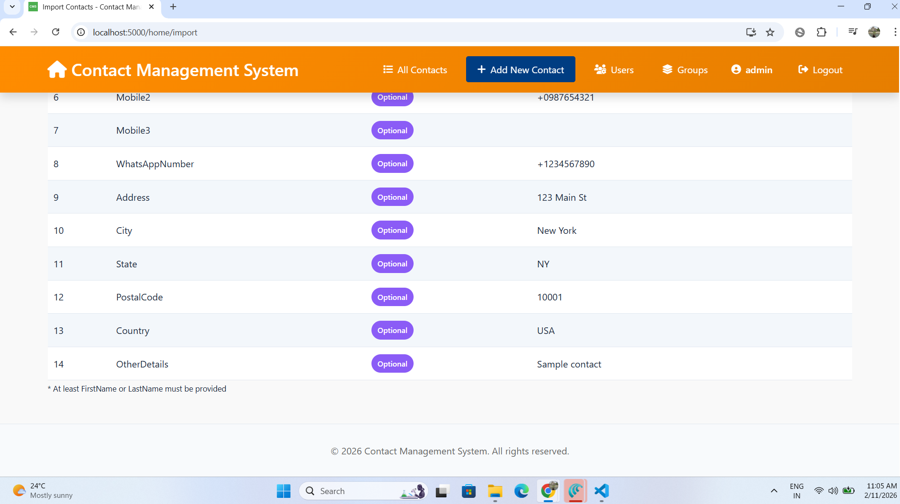

**Steps (final):**
1. Click **Import Contacts**.
2. Review the success or error message.
3. Return to the contact list to confirm imports.

---

## Tips
- Keep contact data clean and consistent.
- Use the import template to avoid formatting errors.
- Review details after importing to confirm accuracy.

## Version
- Document date: February 11, 2026
